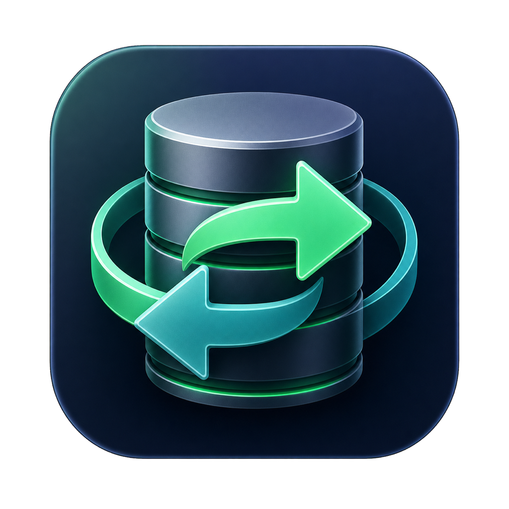

# Mongo Migrator

<p align="center">
  
</p>

Mongo Migrator is a native SwiftUI app for comparing and selectively synchronizing MongoDB data between environments. It supports local MongoDB deployments and MongoDB Atlas, stores credentials in macOS Keychain, and includes a local MCP server for AI coding agents such as Codex, Claude, and Pi.

## Download

[Download Mongo Migrator 0.2.1 for Apple Silicon](https://github.com/fatbuddy/mongo-migrator/releases/download/v0.2.1/Mongo-Migrator-0.2.1-arm64.zip)

Unzip the archive and move **Mongo Migrator.app** to `/Applications`. The internal-team build is ad-hoc signed but not Apple-notarized; on first launch, Control-click the app and choose **Open** if macOS displays an unidentified-developer warning.

All published versions and release notes are available on the [GitHub Releases page](https://github.com/fatbuddy/mongo-migrator/releases).

The app is designed for controlled, on-demand workflows such as:

- Copying production configuration data back to staging.
- Promoting document structures and selected data from staging to production.
- Reviewing document, validator, and index differences before applying changes.
- Migrating complete documents or selected fields and subdocuments.

## Features

### Connection profiles

- Save multiple named environments, including Development, Staging, QA, and Production.
- Connect with `mongodb://` or `mongodb+srv://` connection strings.
- Use unauthenticated local connections or username/password authentication.
- Store passwords only in macOS Keychain.
- Test connections and discover available databases.

### Comparison and migration

- Compare one source database with one destination database.
- Switch source and destination with one migration-direction button.
- Select multiple shared collections in a migration.
- Choose matching collections from a searchable table.
- Match documents with a dropdown populated from compatible MongoDB unique indexes, including `_id`, compound indexes, and partial unique indexes.
- Automatically apply partial index filters, such as `{ "isDeleted": false }`, on both databases during comparison.
- Apply an additional MongoDB filter and permanently exclude environment-specific fields or subdocuments from the migration.
- Compare documents, collection validators, and indexes.
- Review field-level and nested-field differences with inserted, modified, and deleted color states.
- Open large fields and subdocuments in a full side-by-side, scrollable code-review diff with copy controls.
- Choose whether to apply the source, keep the destination, or delete the destination document.
- Select individual fields and subdocuments for updates.
- Exclude a field from every document with one **Skip all** action.
- Preview changes with dry-run mode.
- Require explicit confirmation before deletions.
- Create a local rollback backup before every applied migration.
- Automatically compare again after a migration and confirm when the source and destination are in sync.
- Show comparison progress and errors in an activity log.
- Restore the previous comparison configuration when the app is reopened.
- Keep local migration history with full document details and MCP audit records.
- Revert document changes from a completed applied migration directly from History.

### Migration history and rollback

History records the route, databases, collections, mode, status, and insert/update/delete counts for every preview and applied migration. New history records also retain per-document actions, identity filters, selected field paths, full before/after values, and schema operations for review.

Select a History row to:

- Inspect every affected document and open its complete before/after code-review diff.
- Review the fields selected for migration and any validator or index operations.
- Locate the JSON detail and rollback package stored on the Mac.
- Revert a completed applied migration after explicit confirmation.

Document rollback restores complete pre-migration destination documents and removes documents inserted by the migration. It requires the saved destination connection profile. Rollback can overwrite edits made after the original migration, so verify the destination and back it up before confirming. Validator and index operations are visible in History, but their previous definitions are not captured and cannot currently be reverted automatically.

### MCP server

The bundled stdio MCP server exposes the saved connection profiles to compatible AI agents without returning connection strings or passwords. It provides tools to:

- List saved profiles, databases, and collections.
- Find documents with an Extended JSON filter.
- Compare documents, validators, and indexes.
- Prepare a short-lived migration plan and dry-run preview.
- Apply an approved plan using an exact confirmation phrase.

Write operations are separated into prepare and apply steps. The apply tool is marked as destructive, requires the confirmation returned by the prepared plan, expires plans after 30 minutes, creates a backup first, and consumes a plan after successful use.

## Requirements

- Apple Silicon Mac
- macOS 14 or later
- Xcode 16 or later with the Swift 6 toolchain
- Homebrew
- MongoDB Shell (`mongosh`)

Install `mongosh`:

```sh
brew install mongosh
```

## Build and run

Build the release app bundle:

```sh
./build-app.sh
```

The signed development build is created at:

```text
dist/Mongo Migrator.app
```

Launch it with:

```sh
open "dist/Mongo Migrator.app"
```

The build uses ad-hoc code signing for internal team distribution. It is not notarized or prepared for the Mac App Store.

## Getting started

1. Open **Connections** and create a profile for each MongoDB environment.
2. Enter the connection string and optional username/password authentication.
3. Select **Save & Test** to store the password in Keychain and verify access.
4. Open **Compare & Migrate**.
5. Select the source and destination profiles, then connect.
6. Select the source and destination databases and load their shared collections.
7. Choose collections from the searchable collection table.
8. Select a compatible unique index for each collection. A partial unique index automatically filters out records outside its partial expression.
9. Enter any additional filter and list fields that must never migrate, such as `_id`, `policyId`, `createdAt`, or `updatedAt`.
10. Compare the environments and monitor progress in the activity log.
11. Review document actions and selected fields. Use **View** for a complete code-review diff or **Skip all** to exclude a field from every document.
12. Run a dry-run preview.
13. Disable dry-run mode and apply the migration when the preview is correct. The app automatically compares again and reports whether the source and destination are in sync.
14. Open **History** to inspect the saved migration details or revert document changes when necessary.

Production connections are identified visually, but production writes do not currently require a separate role or administrator approval. Review the destination profile carefully before applying a plan.

## MCP setup

Build the app before configuring an agent. The MCP executable is bundled at:

```text
dist/Mongo Migrator.app/Contents/MacOS/MongoMigratorMCP
```

Open the app and save or test the required profiles before using MCP tools.

### Codex

```sh
./mcp/codex-install.sh
codex mcp get mongo-migrator
```

### Claude Code

```sh
./mcp/claude-install.sh
claude mcp get mongo-migrator
```

The equivalent project configuration is available in [`mcp/claude.mcp.json`](mcp/claude.mcp.json).

### Pi

Pi requires an MCP client extension. The setup script installs `pi-mcp-extension` as a project package and writes `.pi/mcp.json`:

```sh
./mcp/pi-install.sh
```

Start Pi and use `/mcp` to inspect the connection. Review third-party Pi extensions before installing them in a sensitive environment.

The source configuration is available in [`mcp/pi.mcp.json`](mcp/pi.mcp.json).

## MCP tools

| Tool | Access | Purpose |
| --- | --- | --- |
| `mongo_list_profiles` | Read-only | List profile names, IDs, environments, and authentication modes. |
| `mongo_list_databases` | Read-only | List databases available to a saved profile. |
| `mongo_list_collections` | Read-only | List collections in a database. |
| `mongo_find_documents` | Read-only | Query documents with an optional Extended JSON filter. |
| `mongo_compare` | Read-only | Compare documents, validators, and indexes. |
| `mongo_prepare_migration` | Read-only | Create a dry-run plan, preview, expiration, and confirmation phrase. |
| `mongo_apply_migration` | Write/destructive | Apply an approved plan after creating a rollback backup. |

MCP audit records are written to:

```text
~/Library/Application Support/Mongo Migrator/mcp-audit.jsonl
```

## Security model

- Passwords are stored as generic password items in macOS Keychain.
- Saved profile metadata does not contain passwords.
- MCP profile listing does not expose connection strings or credentials.
- MongoDB credentials are passed to the local `mongosh` child process through its environment, not command-line arguments.
- MCP uses local stdio transport and does not open a network listener.
- Migration plans are held in MCP server memory and expire after 30 minutes.
- Applied migrations create local JSON rollback packages.
- Deletions require a distinct `DELETE AND APPLY <plan-id>` confirmation.
- Desktop rollback requires a second confirmation and is available only for completed, non-dry-run migrations with a readable backup and saved destination profile.

Rollback backups are stored at:

```text
~/Library/Application Support/Mongo Migrator/Backups/
```

Backups can contain sensitive destination data. Protect the macOS user account and remove obsolete backups according to the team's retention policy.

## Current scope and limitations

- Synchronization is on demand; change streams and continuous synchronization are not implemented.
- Authentication currently supports unauthenticated connections and username/password credentials.
- SSH tunnels, custom TLS certificate management, IAM, X.509, LDAP, and Kerberos are not included.
- The desktop comparison limit is 5,000 documents per collection; MCP limits requests to 1,000 documents.
- Collections must have matching names in both databases to appear in the desktop collection picker.
- The desktop unique-index dropdown lists indexes whose fields and partial filter are compatible on both source and destination.
- Index synchronization creates or updates source indexes but does not automatically remove destination-only indexes.
- Desktop rollback restores document changes only. Previous validator and index definitions are not captured for automatic restoration.
- Rollback replaces backed-up documents and can overwrite changes made after the migration being reverted.
- Older history records created before document-detail snapshots were introduced may show summary data only.
- The release bundle is intended for internal team use and is ad-hoc signed.

## Development

Build debug executables:

```sh
swift build
```

Run the SwiftUI executable directly:

```sh
swift run MongoMigrator
```

Run the MCP server directly over stdio:

```sh
swift run MongoMigratorMCP
```

Project layout:

```text
.
├── Package.swift
├── Sources
│   ├── MongoMigrator
│   │   └── main.swift
│   └── MongoMigratorMCP
│       └── main.swift
├── build-app.sh
├── Info.plist
└── mcp
    ├── claude-install.sh
    ├── claude.mcp.json
    ├── codex-install.sh
    ├── pi-install.sh
    └── pi.mcp.json
```

## License

This project is licensed under the [GNU General Public License v3.0](LICENSE).
